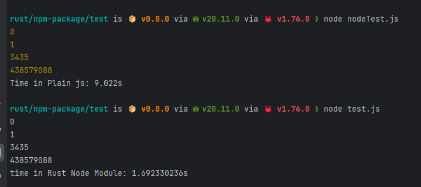

# Compare Münchausen numbers with plain js and napi-rs

This is a simple comparison between a plain JavaScript implementation and a NAPI-RS implementation of the Münchausen
numbers algorithm.

## Result



## How to build

```bash
cd test
yarn install
yarn build
```

## How to run

```bash
nvm use 20
echo "--- Plain JS ---"
node plainJs.js

echo "--- NAPI-RS ---"
node rustModule.js
```